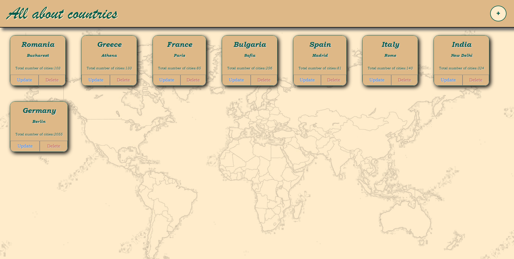
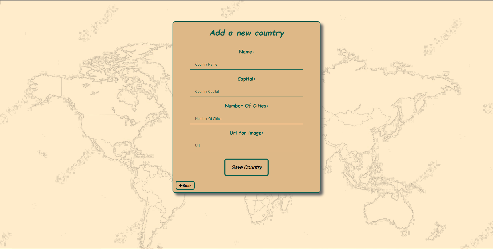
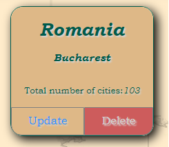
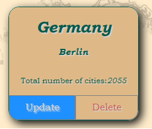
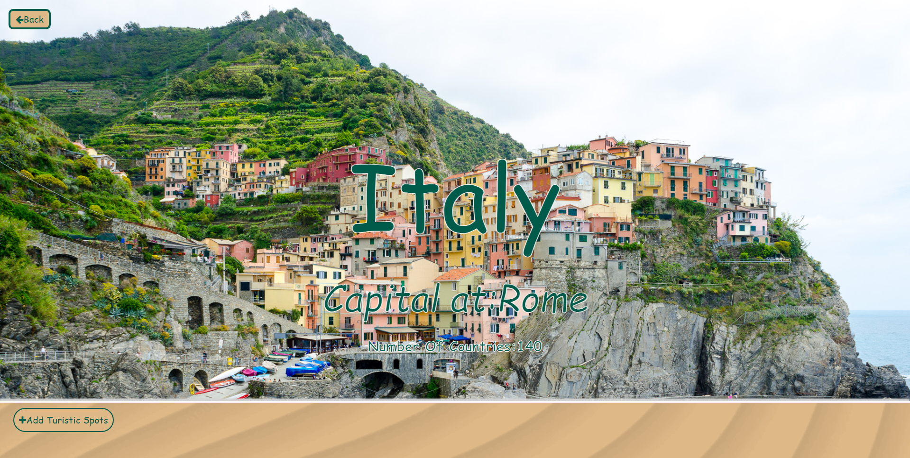
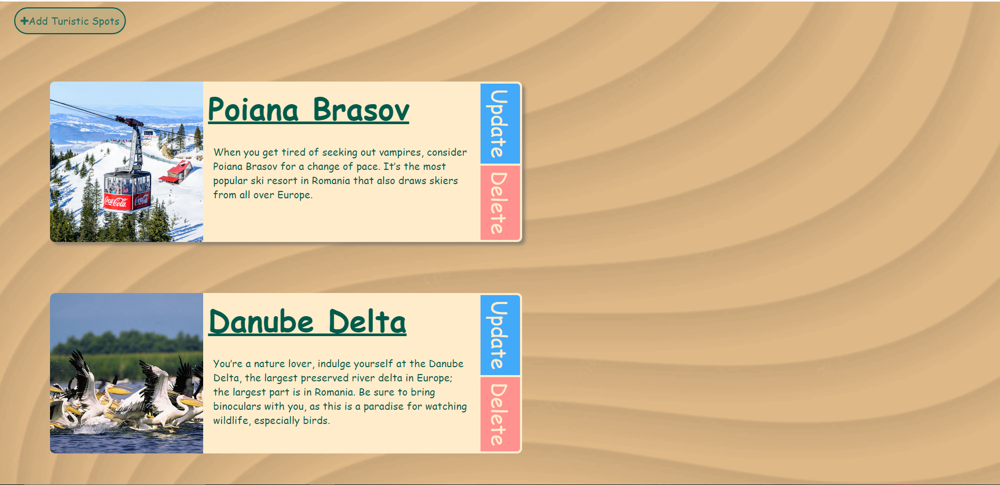

# All about countries

## 1.Introduction

All about countries is a web application that is connected to
a database that allow the user to interact with objects in
the db in a friendly easy way.After completing a form of a country
the app will put it nicely on a page.

## 2.Functionalities

### 2.1 Adding a new country

Creating a new country to put into the database required little 
to no effort at all.Before going to complete all the details 
about the country you want to add is pressing the button on the
top right of the site.After that,a form will be displayed that
you need to fill with details about the country:name,capital,
number of cities and the image that will be displayed in the
background of the page that is about that country.

### 2.2 Deleting a country

The process of deleting a country is easy.When a country is created
it will be displayed on the main page of the site as an ' containter '.
On the bottom left of the container is button that delete the country from
the database and also from the site.

### 2.3 Update or Patch a country

Similar to creating a country,a slighty different form will be displayed
for you after pressing the update button.The form will be already completed
with the old information about a country.You can change it as you with and after
completing this step be sure to save using the "Update Country" button. 

### 2.4 Showing details about a country in an individual page

After pressing on the ' container ' of the country,the aplication will
redirect you to the details page of that country.There will be displayed
the name of the country,the capital,number of cities and in the background
the image you put in the form.

### 2.5 Turistic Spots

In the details page of every country there will be a functionality to create
a touristic spot into that country using a relationship of one to many in the
database.Similar to adding a new country,the form for creating a new touristic spot
will have 3 inputs:Name,Details and a background image for it.After saving it,the turistic
spot will be seen under the details page and can be modified or deleted easily
using the button for update and delete.

## 3.Conclusion

The main purpose of the app is to inform people about the most important characteristics of the
country and what are main touristic spot that you should visit.It has a lot
of useful feature to keep the country and the touristic spots up to date and
allow others to be well informed.